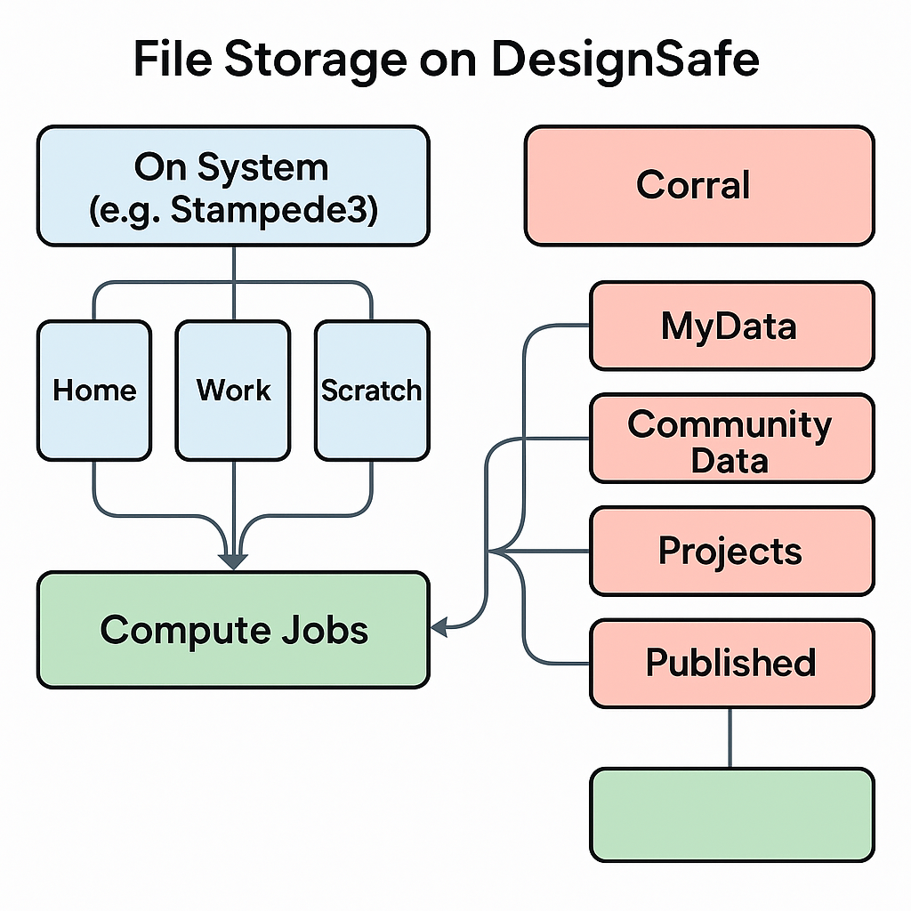

# File Storage Systems
DesignSafe provides three main options for storing and managing your data:

1. **On Corral**, DesignSafe’s central data storage platform
2. **On the Compute System** (e.g., Stampede3)
3. **On the Compute Node(s),** temporary storage that is physically located on each node.

Each option serves different needs and offers distinct advantages depending on the stage of your workflow.

To improve data access and user experience, both **Corral** and the **Work** directory are accessible in the Data Depot and the Jupyter-based systems. The compute-node storage can be accessed only during the job -- once a node(s) has been assigned to the job.

The diagram below helps you visualize the flow of data between. In this diagram, the node storage is within the Compute Jobs  green black-box.

