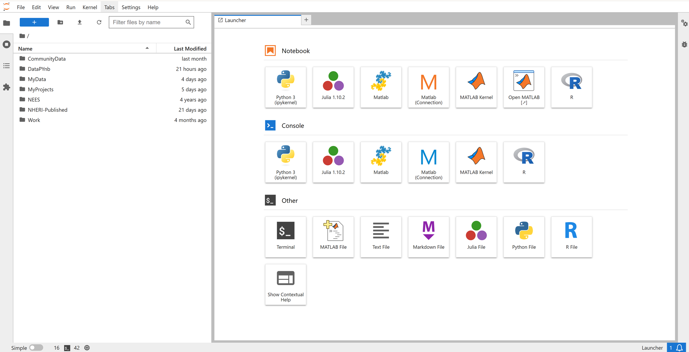
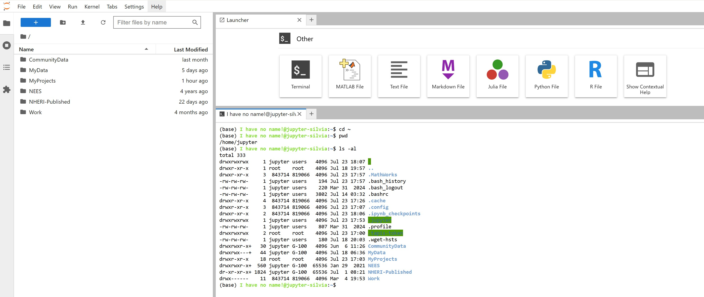
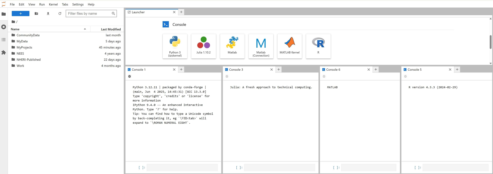
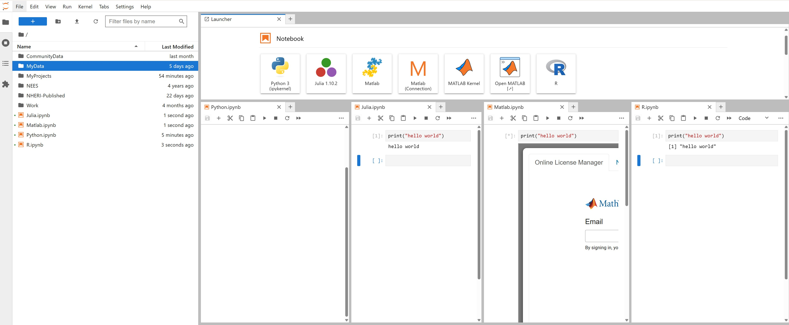
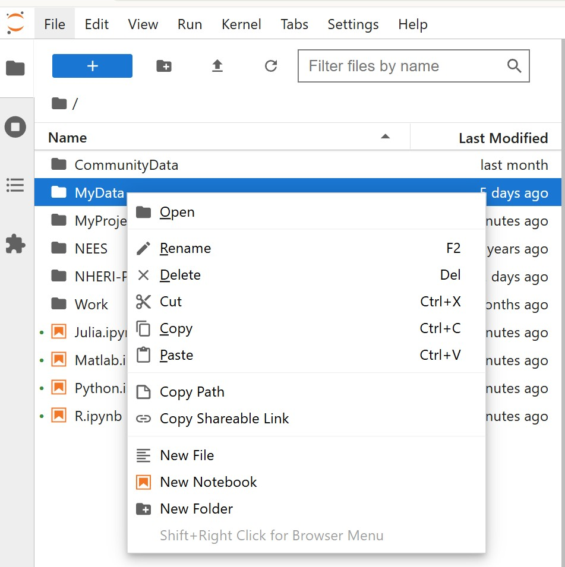
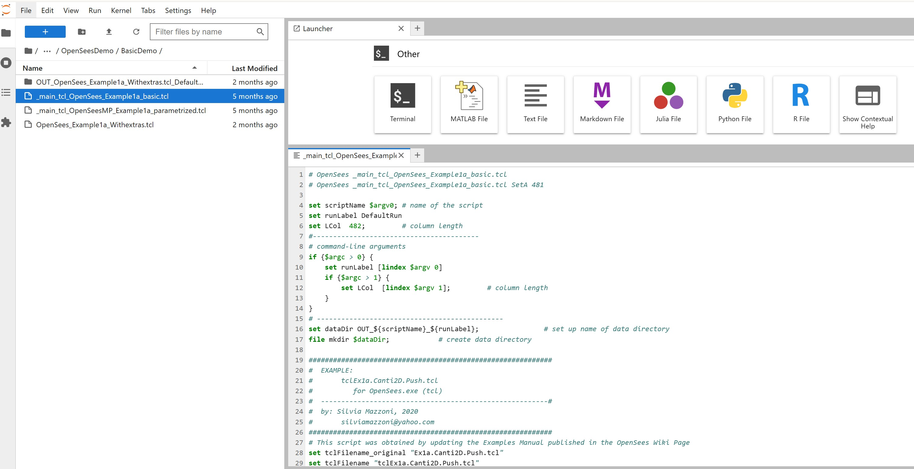
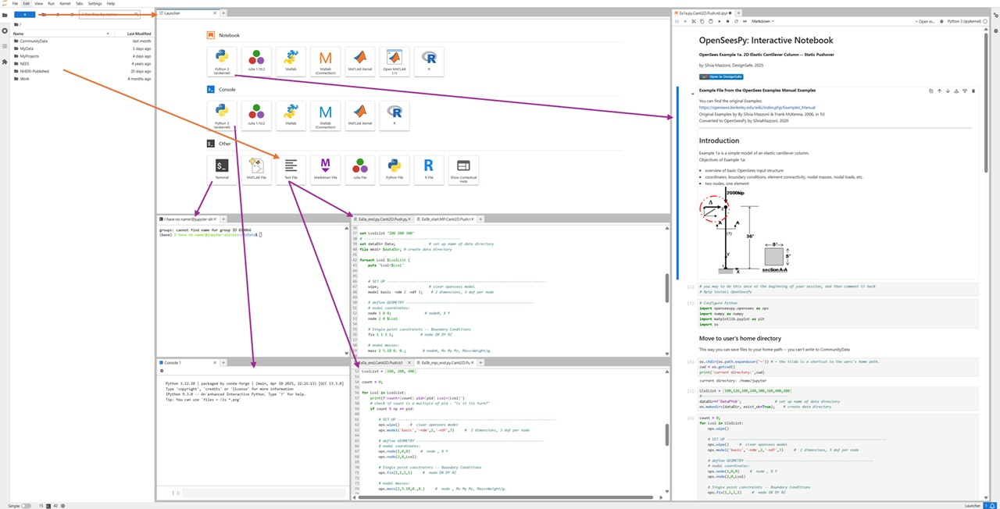

# JupyterHub Tools
***Integrated Tools in Jupyter Hub***

JupyterHub is a web-based Integrated Development Environment (IDE) that provides a unified workspace where you can manage every stage of your workflow—from editing scripts and running analyses to visualizing results—all from a single, browser-accessible dashboard, as shown in the figures below.

Each user session comes equipped with Notebooks, Consoles, Terminal Access, and text-file editors. Jupyter Hub supports **Python** like **Julia**, **MATLAB**, and **R** — useful for researchers integrating multi-language workflows.

You can click the "Open in DesignSafe" button to start a JupyterHub session -- you will be asked to log in: 

The tools can be accessed from the JupyterHub **Launcher**, shown in the figure below:

You can access the launcher by pressing the blue "+" on the top left of the Jupyter dashboard. You can launch any item by double-clicking on it.

As shown in the figures at the bottom of this page: **You can have multiple** items open symultaneously. You can arrange them as windows or as tabs.

:::{dropdown} **Terminal**

* A full Linux command-line interface (CLI) that allows users to run OpenSees (Tcl or Python) scripts directly, compile code, use Git, or execute batch-style workflows.
* Provides **real-time error messages**, standard input/output handling, and access to the full Python and Unix toolchain.
* Especially useful for:

 * Running OpenSees, OpenSeesMP, OpenSeesSP, or OpenSeesPy jobs at the command line
 * File manipulation and quick testing
 * Using tools like *grep*, *awk*, *sed*, and *tar* for advanced scripting

:::

:::{dropdown} **Console**

* A standalone REPL (Read-Eval-Print Loop) environment for Python.
* Allows you to test snippets of OpenSeesPy code without launching a full notebook.
* Can also be used to execute full *.py* scripts.
* Jupyter Hub supports **Python** like **Julia**, **MATLAB**, and **R**

:::

:::{dropdown} **Notebook Interface (Jupyter Notebooks)**

* Combines executable code, documentation, and visualizations in a single document.
* Ideal for OpenSeesPy workflows, where users can iteratively run cells, plot results, and write notes alongside their code.
* Great for **pre- and post-processing**, exploring parameter sweeps, and documenting research workflows.
* Jupyter Hub supports **Python** like **Julia**, **MATLAB**, and **R**

:::

:::{dropdown} **File Manager**

* Visual interface for navigating, organizing, renaming, and deleting files in your Jupyter workspace.
* Drag-and-drop support for uploading or downloading files.
* Makes it easy to keep your project folder tidy and to stage input/output files for HPC runs.

:::

:::{dropdown} **Text Editor (Code Editor)**

* Built-in lightweight code editor with syntax highlighting for Tcl, Python, JSON, and other formats.
* Allows quick edits to scripts without switching to a notebook or terminal editor like *vim*.
* Useful for:

 * Editing input scripts
 * Creating SLURM job files
 * Modifying *metadata.json* or *app.json* files when working with Tapis

:::

The following screenshot is an "extreme" example of how you can use all of these tools symultaneously:

## Summary

The Jupyter Hub environment is your **workbench for development, debugging, testing, and launching HPC jobs** — all without leaving your browser.

