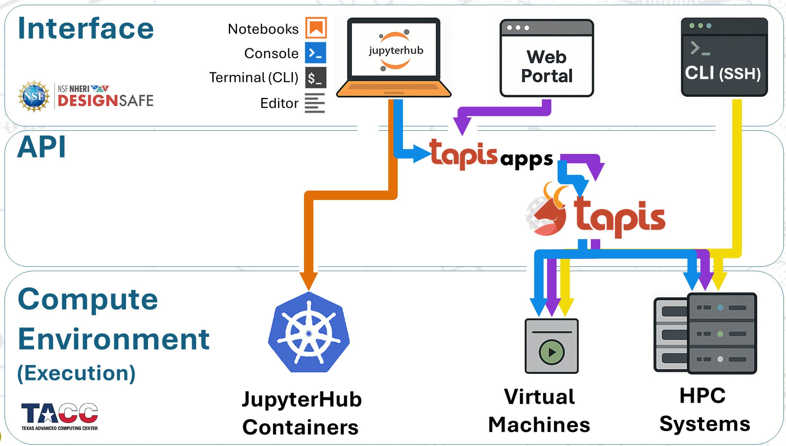
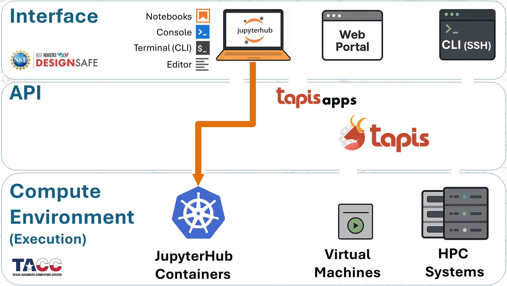
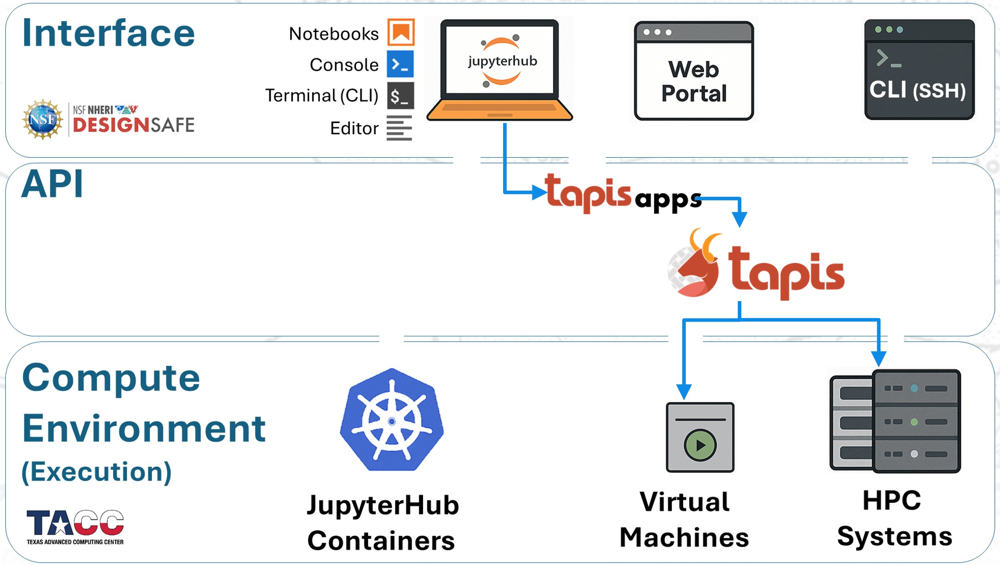

# OpenSees on DesignSafe

**OpenSees** was conceptualized, designed, and developed with parallel computing as its core objective. An application designed for parallel computing takes advantage of multiple processors working simultaneously on independent tasks as well as on interdependent ones where the processors can pass information to each other. Within these parallel-computing design concepts, there are 3+1 application of OpenSees, each designed with a different objective

**DesignSafe** provides different platforms to run the OpenSees applications in **TACC**. These platforms have been designed with scalability in mind -- each platform is optimized for a wide range of project objectives, size, and scope.

The choice of *OpenSees Application* and *DesignSafe Platform* depends on your project needs, which may be different at different stages. The integrated environment on DesignSafe allows seamless scalability.

## Workflows for OpenSees on DesignSafe
1. Submit Job to HPC from the Web Portal via Tapis Apps
2. Run OpenSees within Jupyter Hub
3. Submit Job to HPC from JupyterHub via Tapis Apps
4. Submit SLURM Job to HPC manually from a Node in HPC

These methods are shown in the diagram below.

## Recommendations
1. Run small/medium jobs within Jupyter Hub -- it has 8 processors

2. Submit medium/large jobs to HPC from JupyterHub -- it has the most efficient job-handling workflow

