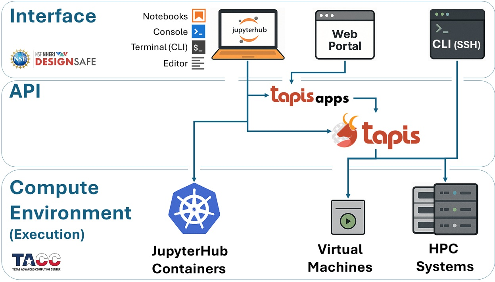

# Computational Workflows

DesignSafe’s cyberinfrastructure brings together the **computational power of TACC** with the **ease of cloud-based interfaces**, allowing researchers to move seamlessly between interactive exploration and large-scale, production-level computation. Whether you’re testing a small OpenSees model inside a Jupyter notebook or deploying thousands of simulations across Stampede3, DesignSafe’s ecosystem is built to scale with you — from one core to tens of thousands.

At its heart, DesignSafe is not just a collection of tools — it’s a **workflow system** designed to support the full life cycle of computational research:

* developing models and scripts,
* running and monitoring simulations,
* managing input/output data, and
* sharing or reproducing results.

Each of these stages may occur in a **different computational environment**, accessed through **different interfaces**, but connected by a **common middleware layer** that handles execution, authentication, and data transfer. This structure makes DesignSafe powerful, but it also means that understanding *how jobs flow through the system* is key to working efficiently and avoiding common pitfalls.

When you launch a job, several things happen behind the scenes:
your code or application is packaged, transferred to a compute system, queued by a scheduler, executed across one or more nodes, and then results are retrieved and stored for postprocessing.
Each of these steps occurs in a specific **layer** of the architecture — the **execution environment**, the **interface environment**, and the **API layer** that connects them.

Understanding these layers helps you:

* choose the right tool for your task (interactive vs. batch, container vs. HPC),
* optimize job performance and resource allocation,
* build automated, portable workflows that scale from prototypes to production, and
* troubleshoot or customize advanced workflows with confidence.

In this section, we’ll walk through the **workflow architecture** of DesignSafe and TACC — the backbone that ties together interactive computing, batch processing, and job automation.

## Workflow Architecture

***Execution, Interface, and Automation***

Understanding how jobs are submitted, where they run, and how you interact with the underlying systems is essential for building **scalable, portable, and efficient workflows** that make full use of DesignSafe’s and TACC’s capabilities.

Every computational job on DesignSafe follows a similar path:
you **interact** with it through a user-facing interface, it **runs** in a compute environment, and these two sides communicate through an **API** layer that handles job submission, monitoring, and data movement.

To make sense of this architecture, we divide it into three core layers — shown in the diagram below — that together define how your work travels through the system:

* **Execution Environments** — Where your jobs are actually run
* **Interface Environments** — How you access the execution environments, interact with DesignSafe, and prepare/submit/postprocess jobs
* **APIs** — The middleware that connects your interfaces to the execution resources

These layers form a cohesive pipeline: you work at the interface level, Tapis handles orchestration, and your code executes on HPC hardware. 

## Execution Environments

:::{dropdown} *Where Your Jobs Run*

Every job you launch on DesignSafe ultimately runs somewhere on TACC infrastructure. Depending on the size and style of your analysis, your job can land in one of three places:

1. **JupyterHub Containers (Kubernetes Cluster)**
   Great for prototyping, testing, or small-scale runs. You get an **isolated container** with up to **8 CPU cores and 20 GB RAM**. This is limited to a single node, so it’s best for development work rather than production-scale simulations.

2. **Virtual Machines (VMs)**
   Targeted at lightweight or specialized workloads. Some VMs are configured only to receive jobs (e.g., **OpenSees-EXPRESS**, which accepts submit-only jobs through Tapis), while older interactive VMs have now been replaced by JupyterHub. Like containers, these are single-node.

3. **HPC Systems at TACC**
   For large simulations, your jobs scale up to **supercomputers** such as:

   * **Stampede3** (general-purpose, multi-node)
   * **Frontera**, **Vista**, or **Lonestar6** (specialized or experimental systems)

   These require **batch submission** through the SLURM scheduler, but in exchange they unlock thousands of cores and huge memory pools.

:::

---

## Interface Environments

:::{dropdown} *How You Access the Compute Systems*

Once you know *where* your job will run, the next step is deciding *how* you’ll interact with the system. DesignSafe gives you multiple access points, each with different levels of flexibility:

1. **JupyterHub (Kubernetes)**
   The most common starting point. A browser-based environment where you can write code, visualize data, and even launch HPC jobs directly through the Tapis API.

2. **Web Portal**
   The simplest option: point-and-click job submission. Preconfigured Tapis Apps (e.g., OpenSees, OpenSeesSP, OpenSeesMP) let you submit runs to Stampede3 without worrying about command-line syntax or schedulers. Ideal for new users or quick launches.

3. **SSH (Terminal Login)**
   For advanced control, you can log directly into TACC systems. Here you can edit files, manage storage, load modules, and submit custom SLURM jobs — the “raw” HPC experience.

4. **Jupyter on HPC Nodes**
   Less common, but useful if you need the full memory and cores of a single node. This launches JupyterLab directly on an HPC compute node, but it comes with queue wait times and is not recommended for large workflows.

:::

---

## Tapis API

:::{dropdown} *How Interfaces Submit Jobs to Execution Resources*

Behind the scenes, every job launched from DesignSafe is carried into TACC’s systems by the **Tapis API**. Think of Tapis as the **job courier and workflow manager**:

* It takes your inputs (from JupyterHub, Web Portal, or CLI)
* Packages them into a **SLURM batch job**
* Transfers files to the right place on Stampede3 or a VM
* Submits, monitors, and retrieves results

You can interact with Tapis in three ways:

* **Indirectly** — Every time you use the Web Portal or preconfigured Tapis Apps.
* **Semi-directly** — Submitting jobs via the CLI or scripts inside Jupyter.
* **Directly** — Calling the Tapis REST API or using Python libraries like `tapipy` to build automated pipelines.

Tapis is what makes the system scalable and reproducible, whether you’re running one job today or thousands over the course of a project.

:::

 

The following diagram gives you a snapshot of these components and how they contribute to the workflow we will be presenting in this training module.

