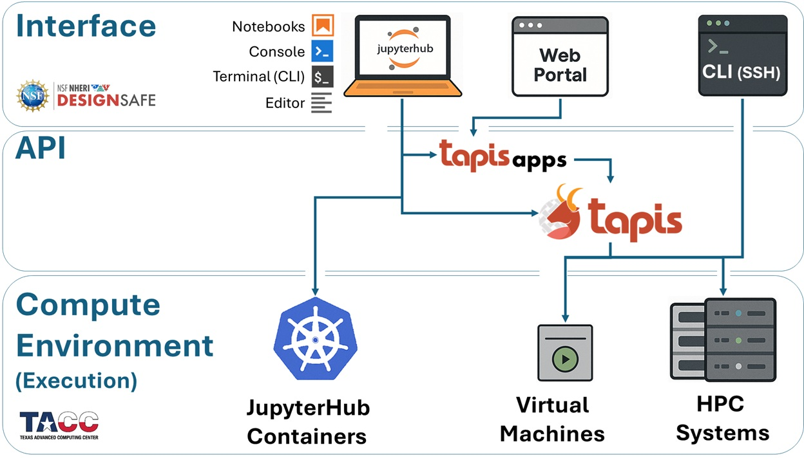

# DesignSafe & TACC

**DesignSafe** offers a comprehensive environment for conducting, managing, and analyzing workflows related to natural hazards engineering. It combines interactive tools, data services, and computational resources to support your entire research lifecycle — from model development to large-scale simulations to advanced post-processing.

At its core, DesignSafe is tightly integrated with the **Texas Advanced Computing Center (TACC)**, which supplies the <u>high-performance computing (HPC) systems and large-scale storage</u> required to execute demanding analyses. Most jobs submitted through DesignSafe — whether via the web portal, Jupyter notebooks, or automated pipelines — ultimately run on TACC’s powerful supercomputers like **Stampede3**, making it possible to carry out simulations that would be unfeasible on local machines.

DesignSafe’s platform is built with **flexibility and scalability in mind**: whether you are testing small models interactively or deploying large-scale simulations across thousands of cores, the system adapts to your needs.

But to make the most of this power, you need to understand how jobs move through the system — from the interfaces you use, to the compute environments where they execute, to the middleware that links the two.

This brings us to the **workflow architecture** of DesignSafe and TACC.

---

## Workflow Architecture

***Execution, Interface, and Automation***

Understanding how jobs are submitted, where they run, and how you interact with the underlying systems is essential for building **scalable, portable, and efficient workflows** on DesignSafe and TACC.

To guide you through the full landscape, we divide the system into three key layers, as shown in the diagram below:

* **Execution Environments** — Where your jobs are actually run
* **Interface Environments** — How you access the execution environments, interact with DesignSafe, and prepare/submit/postprocess jobs
* **APIs** — The middleware that connects your tools to compute resources (e.g., Tapis)

Let’s examine each of these layers in turn.

Perfect — here’s a reworked version of the **Execution / Interface / API subsections** so they still preserve the dropdown structure (good for reference), but the text reads more like a guided walkthrough. This way, the reader feels like you’re telling them a story about how their job flows through the system rather than just listing features.

---

## Execution Environments

:::{dropdown} *Where Your Jobs Run*

Every job you launch on DesignSafe ultimately runs somewhere on TACC infrastructure. Depending on the size and style of your analysis, your job can land in one of three places:

1. **JupyterHub Containers (Kubernetes Cluster)**
   Great for prototyping, testing, or small-scale runs. You get an **isolated container** with up to **8 CPU cores and 20 GB RAM**. This is limited to a single node, so it’s best for development work rather than production-scale simulations.

2. **Virtual Machines (VMs)**
   Targeted at lightweight or specialized workloads. Some VMs are configured only to receive jobs (e.g., **OpenSees-EXPRESS**, which accepts submit-only jobs through Tapis), while older interactive VMs have now been replaced by JupyterHub. Like containers, these are single-node.

3. **HPC Systems at TACC**
   For large simulations, your jobs scale up to **supercomputers** such as:

   * **Stampede3** (general-purpose, multi-node)
   * **Frontera**, **Vista**, or **Lonestar6** (specialized or experimental systems)

   These require **batch submission** through the SLURM scheduler, but in exchange they unlock thousands of cores and huge memory pools.

:::

---

## Interface Environments

:::{dropdown} *How You Access the Compute Systems*

Once you know *where* your job will run, the next step is deciding *how* you’ll interact with the system. DesignSafe gives you multiple access points, each with different levels of flexibility:

1. **JupyterHub (Kubernetes)**
   The most common starting point. A browser-based environment where you can write code, visualize data, and even launch HPC jobs directly through the Tapis API.

2. **Web Portal**
   The simplest option: point-and-click job submission. Preconfigured Tapis Apps (e.g., OpenSees, OpenSeesSP, OpenSeesMP) let you submit runs to Stampede3 without worrying about command-line syntax or schedulers. Ideal for new users or quick launches.

3. **SSH (Terminal Login)**
   For advanced control, you can log directly into TACC systems. Here you can edit files, manage storage, load modules, and submit custom SLURM jobs — the “raw” HPC experience.

4. **Jupyter on HPC Nodes**
   Less common, but useful if you need the full memory and cores of a single node. This launches JupyterLab directly on an HPC compute node, but it comes with queue wait times and is not recommended for large workflows.

:::

---

## Tapis API

:::{dropdown} *How Interfaces Submit Jobs to Execution Resources*

Behind the scenes, every job launched from DesignSafe is carried into TACC’s systems by the **Tapis API**. Think of Tapis as the **job courier and workflow manager**:

* It takes your inputs (from JupyterHub, Web Portal, or CLI)
* Packages them into a **SLURM batch job**
* Transfers files to the right place on Stampede3 or a VM
* Submits, monitors, and retrieves results

You can interact with Tapis in three ways:

* **Indirectly** — Every time you use the Web Portal or preconfigured Tapis Apps.
* **Semi-directly** — Submitting jobs via the CLI or scripts inside Jupyter.
* **Directly** — Calling the Tapis REST API or using Python libraries like `tapipy` to build automated pipelines.

Tapis is what makes the system scalable and reproducible, whether you’re running one job today or thousands over the course of a project.

:::

 

The following diagram gives you a snapshot of these components and how they contribute to the workflow we will be presenting in this training module.

