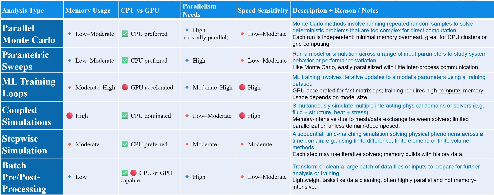

# DesignSafe & TACC

**DesignSafe** offers a comprehensive environment for conducting, managing, and analyzing workflows related to natural hazards engineering. It combines interactive tools, data services, and computational resources to support your entire research lifecycle — from model development to large-scale simulations to advanced post-processing.

At its core, DesignSafe is tightly integrated with the **Texas Advanced Computing Center (TACC)**, which supplies the <u>high-performance computing (HPC) systems and large-scale storage</u> required to execute demanding analyses. Most jobs submitted through DesignSafe — whether via the web portal, Jupyter notebooks, or automated pipelines — ultimately run on TACC’s powerful supercomputers like **Stampede3**, making it possible to carry out simulations that would be unfeasible on local machines.

DesignSafe’s platform is built with **flexibility and scalability in mind!**

## Varying Computational Needs
The following table provies an example of the different computation needs for different types of analyses:

| Analysis Type          | Description  |
|-------------------------|-------------------------------|
| Parallel Monte Carlo    | Monte Carlo methods involve running repeated random samples to solve deterministic problems that are too complex for direct computation.  |
| Parametric Sweeps       | Run a model or simulation across a range of input parameters to study system behavior or performance variation.  |
| ML Training Loops       | ML training involves iterative updates to a model's parameters using a training dataset. |
| Coupled Simulations     | Simultaneously simulate multiple interacting physical domains or solvers (e.g., fluid + structure, heat + stress).  |
| Stepwise Simulation     | A sequential, time-marching simulation solving physical phenomena across a time domain, e.g., using finite difference, finite element, or finite volume methods.  |
| Batch Pre/Post-Processing | Transform or clean a large batch of data files or inputs to prepare for further analysis or training.  |

| Analysis Type          | Memory Usage     | CPU vs GPU          | Parallelism Needs | Speed Sensitivity | Reason / Notes |
|-------------------------|------------------|---------------------|-------------------|-------------------|-------------------------------|
| Parallel Monte Carlo    | 🔹 Low–Moderate  | ✅ CPU preferred     | 🔹 High           | 🔸 Low–Moderate   | Trivially parallel: each run is independent; minimal memory overhead, great for CPU clusters or grid computing. |
| Parametric Sweeps       | 🔹 Low–Moderate  | ✅ CPU preferred     | 🔹 High           | 🔸 Low–Moderate   | Like Monte Carlo, easily parallelized with little inter-process communication. |
| ML Training Loops       | 🔸 Moderate–High | 🔴 GPU accelerated  | 🔹 Moderate–High  | 🔴 High           | GPU-accelerated for fast matrix ops; training requires high compute, memory usage depends on model size. |
| Coupled Simulations     | 🔴 High          | ✅ CPU dominated     | 🔸 Low–Moderate   | 🔴 High           | Memory-intensive due to mesh/data exchange between solvers; limited parallelization unless domain-decomposed. |
| Stepwise Simulation     | 🔸 Moderate      | ✅ CPU preferred     | 🔸 Moderate       | 🔸 Moderate       | Each step may use iterative solvers; memory builds with history data. |
| Batch Pre/Post-Processing | 🔹 Low         | ✅🔴 CPU or GPU capable | 🔹 High          | 🔸 Low–Moderate   | Lightweight tasks like data cleaning, often highly parallel and not memory-intensive. |
