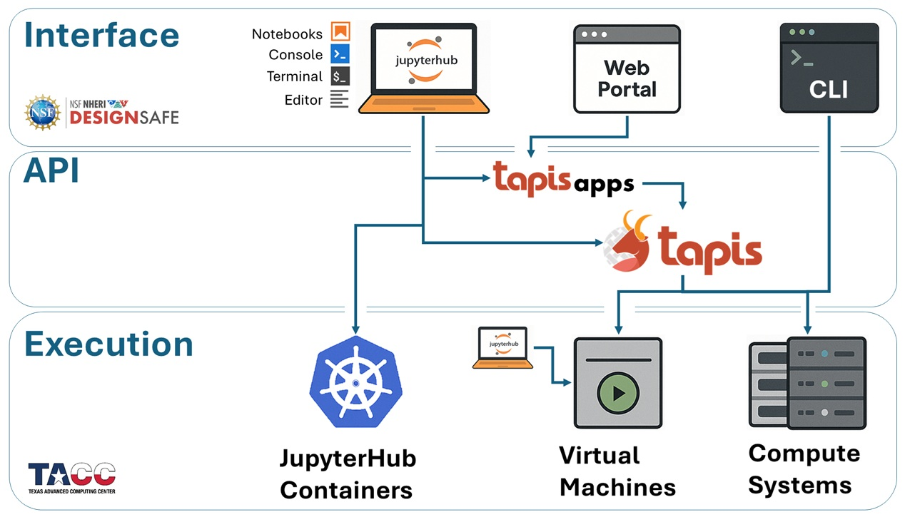

# Tapis
***What is Tapis?***

Tapis is a **network-based API** built on **REST architecture**, enabling users to manage computational jobs, data, and workflows across high-performance computing (HPC) and cloud systems — all through a consistent and secure interface.

* **API** = Application Programming Interface — a programming layer that allows different software tools to talk to each other.
* **Networked API** = APIs that communicate over a network (like the internet).
* **REST Architecture** = "REpresentational State Transfer" — a common architectural style for web services that uses standard HTTP methods (GET, POST, PUT, DELETE).

---

## Why Use Tapis?

Tapis provides:

* **Seamless access to powerful compute systems**, like those at TACC via DesignSafe
* **Tracking of your entire analysis pipeline**, including inputs, outputs, app version, and parameters
* **Reproducibility**, by saving job metadata and input references so you can rerun analyses exactly
* **Collaboration and sharing**, allowing you to share files, apps, and jobs with team members — with access controls
* **No infrastructure to maintain** — Tapis is hosted and maintained for you

---

## What Are Tapis Applications?

**Tapis Apps are the foundation of the Tapis job workflow.** They enable consistent, portable, and sharable execution of complex analyses across compute systems.

A **Tapis App** is a **preconfigured, reusable execution template** that defines:

* The program or container to be run (e.g., OpenSees, OpenFOAM, custom scripts)
* What **inputs**, **parameters**, and **environment variables** it expects
* The **execution system** (like Stampede3) where the job should run
* How the job should be launched (e.g., runtime settings, number of cores)

These apps allow you to submit jobs using consistent interfaces without worrying about job script formatting, environment setup, or scheduling details.

---

## What Can Tapis Do?

Tapis offers more than just job submission:

* **File Management Commands**: Upload, download, move, copy, and list files on Tapis-enabled systems
* **Job Monitoring Functions**: Track job status, duration, output logs, and exit codes
* **Job Metadata Queries**: Retrieve full job history, input parameters, and archiving locations
* **Job Submission via Apps**: Run your simulations or analyses by submitting jobs to a registered Tapis App

All of these capabilities can be accessed through:

* **Web interfaces**, like the DesignSafe portal
* **Python code**, using the `tapipy` SDK in Jupyter notebooks
* **Command Line (CLI)** tools on JupyterHub or local terminals
* **Direct REST calls**, using `curl` or SimCenter tools

---

## Tapis Workflow

Most DesignSafe applications powered by Tapis follow this general pattern:

1. **Authenticate** with Tapis (get a token)
2. **Upload files** to a Tapis storage system (if needed)
3. **Submit a job** using a registered App and your input
4. **Monitor job status** (pending → running → finished)
5. **Download or archive output data** for further analysis

---

## Tapis Documentation
1. [Tapis Project Page](https://tapis-project.org/)
2. [Tapis Documentation](https://tapis.readthedocs.io/en/latest/index.html)
3. [tapipy Documentation](https://tapis.readthedocs.io/en/latest/technical/pythondev.html)
4. [tapipy GitHub Page](https://github.com/tapis-project/tapipy/blob/main/tapipy/resources/openapi_v3-apps.yml)

